# Vectorstore Chunk Visualization App With DataRobot

**Author:** senkin.zhan@datarobot.com

## Problem framing

This AI Accelerator demonstrates how to implement a Streamlit application to gain insight from vectordatabase of chunks, RAG developer can compare similarity between chunks and remove unnecessary data during RAG development.

## Accelerator overview

The following steps outline the accelerator workflow.

## From nextgen->registry->application, build a streamlit application.
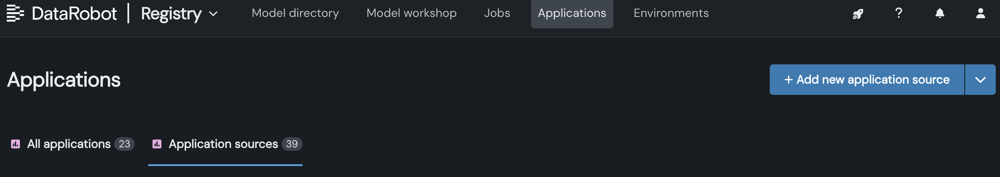
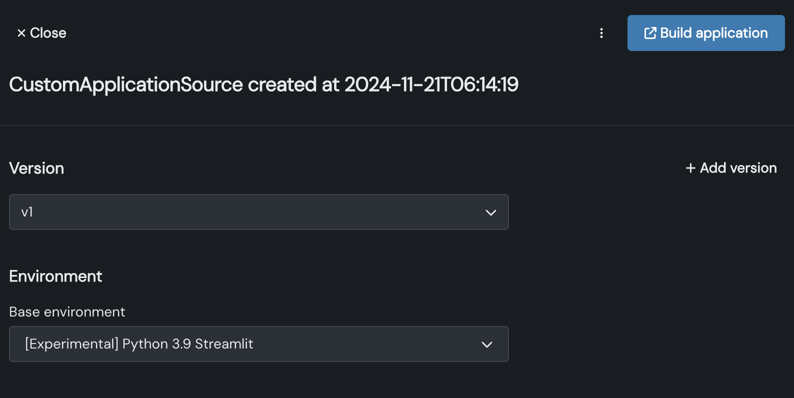
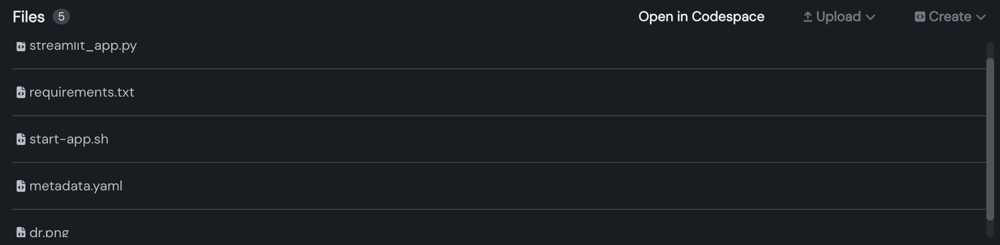
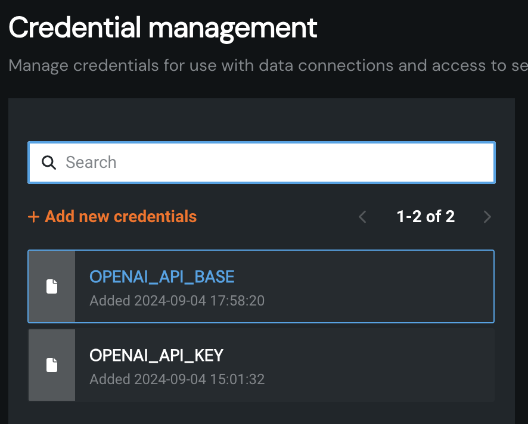 
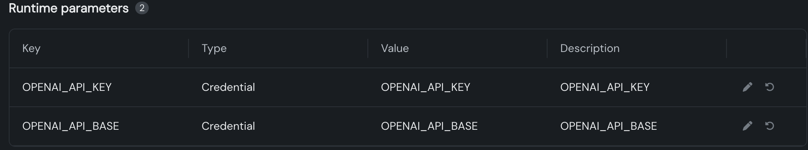

## Upload document to build vectorstore on datarobot.
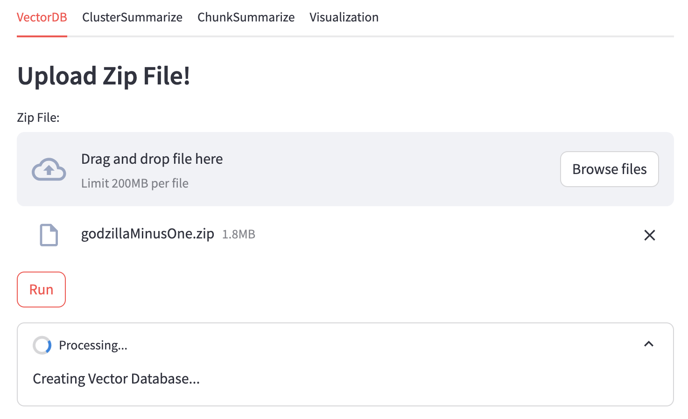

## Build summary of cluster by Azure OpenAI service.
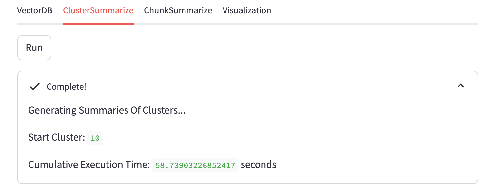

## Build summary of chunk by Azure OpenAI service.
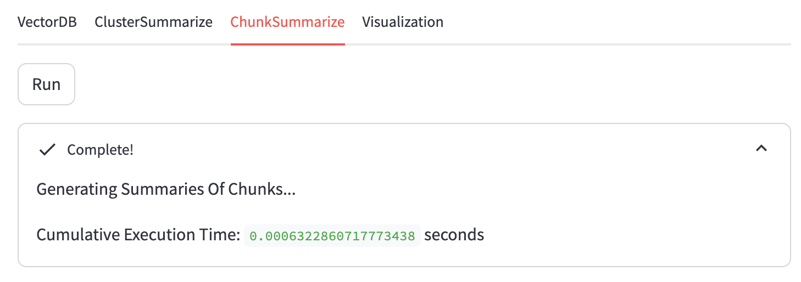

## Select how many clusters of chunk.
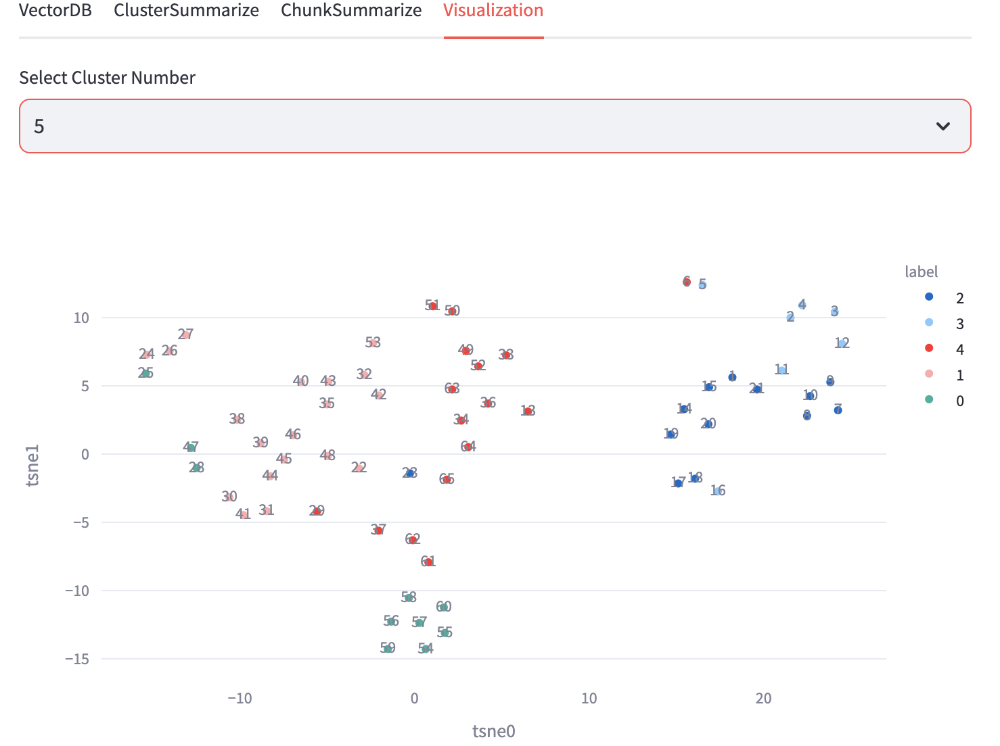

## View the summaries of cluster and chunk.
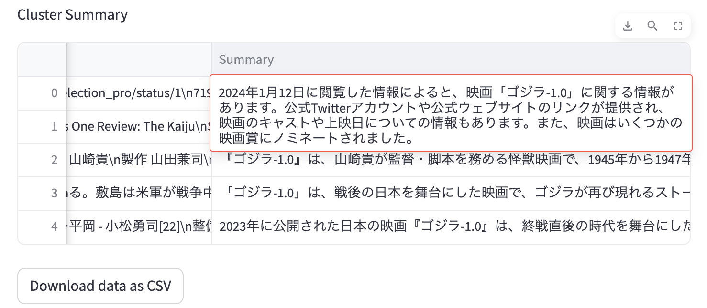
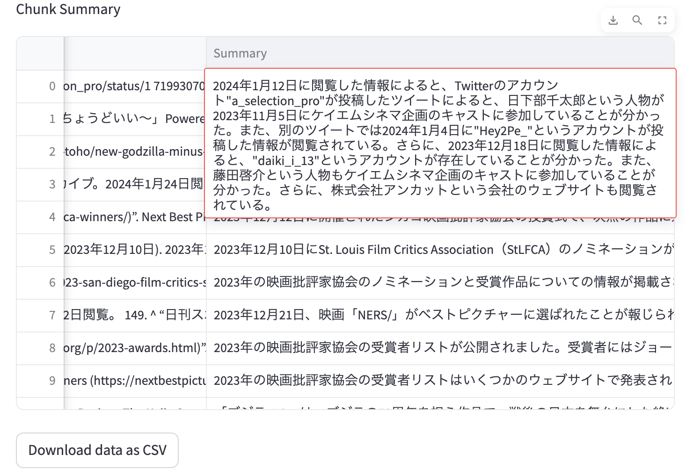

